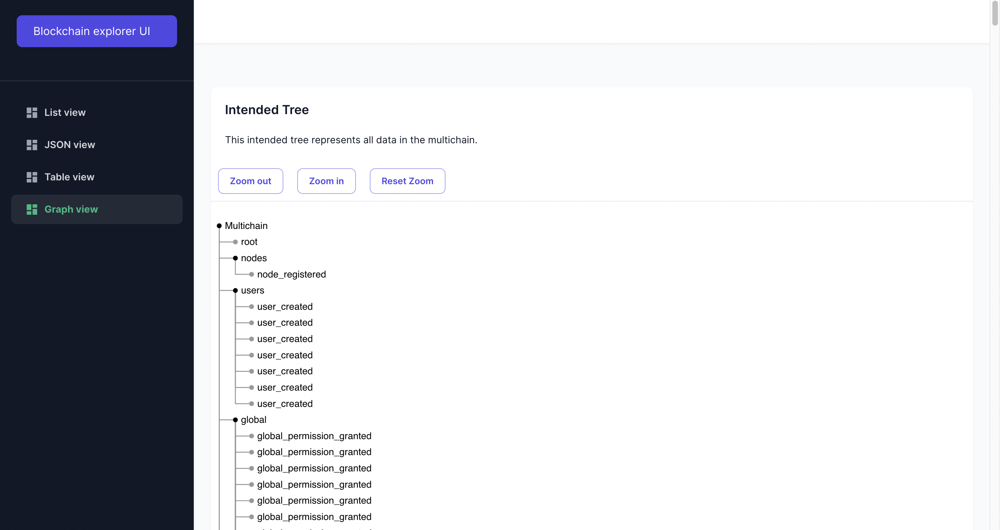
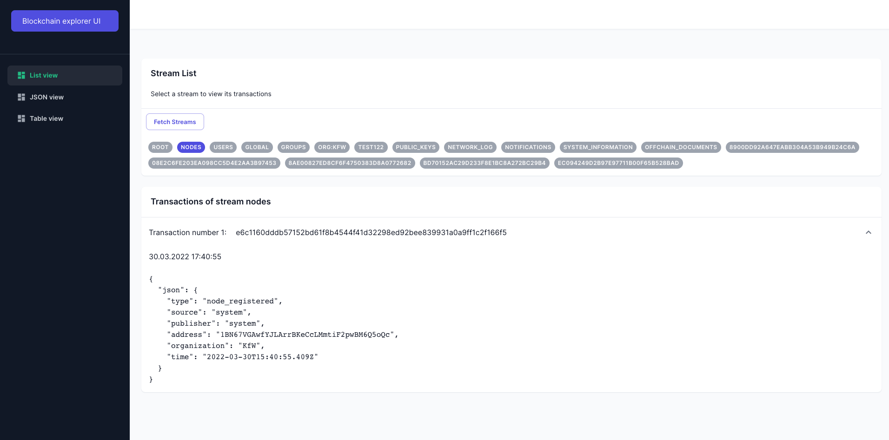
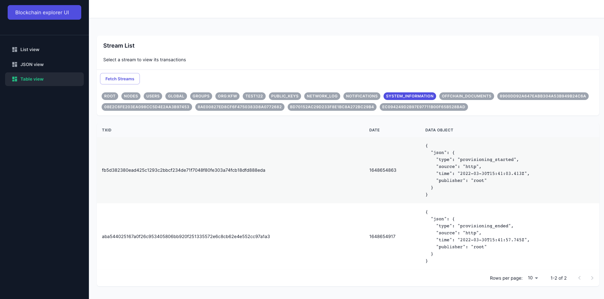
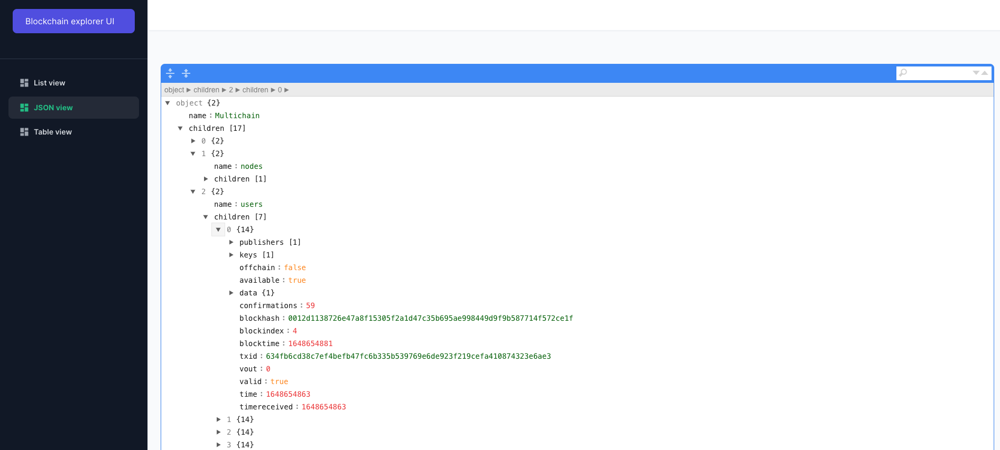

# Multichain explorer with ExpressJS and NextJS.

This is an application with frontend and backend to view the data that is stored in the [Multichain platform](https://www.multichain.com/).

## Getting started

To run a demo version of this project, you need to run the Multichain, API and UI:

To start the multichain with mocked data in Docker, run `bash start-trubudget-multichain.sh`

To start the API in development mode, run `cd blockchain-explorer` and `npm run dev`

To start the UI in development mode, run `cd explorer-ui` and `npm run dev`

## Features

The Blockchain Explorer allows you to view the Multichain data in three different modes:

- Tree View
- List View
- Table View
- JSON View

### Screenshots

#### Tree view

#### List view

#### Table view

#### JSON view

